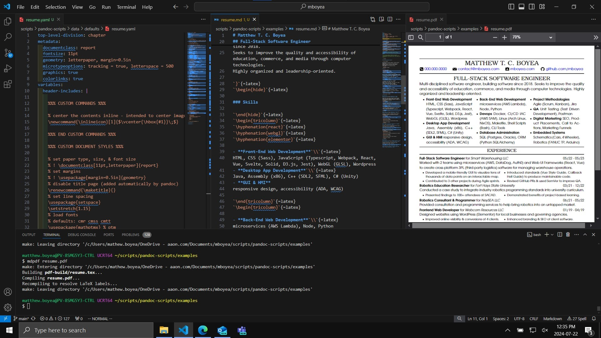

## Markdown Converter (mdc) compiles plaintext documents from Markdown into other formats using Pandoc + Makefile + Bash

I use these scripts to convert my Markdown files into other document formats at work and on my home computer.
The Windows installation process does not require administrator privileges at any step, so **the IT department** doesn't disallow it.



### Install (Windows)

- Install [Pandoc for Windows](https://github.com/jgm/pandoc/releases/)
- Install [MiKTeX (LaTeX for Windows)](https://miktex.org/download)
- Install [MSYS2 (Linux build tools for Windows)](https://www.msys2.org/)
- Install Git, Makefile, and WatchExec: In MSYS2 UCRT64, run `pacman -S git make mingw-w64-ucrt-x86_64-watchexec`
- Clone this repository: In MSYS2 UCRT64, `cd` to the directory you want to install this repository and run `git clone https://github.com/mboyea/mdc`
- In `C:\msys64\home\<user>\.bashrc` add line `alias mdpdf='<INSERT_PATH_TO_PANDOC_SCRIPTS>/pandoc-scripts/mdpdf.sh'`
- In `C:\msys64\home\<user>\.bash_profile` add line `if [ -f ~/.bashrc ]; then . ~/.bashrc; fi`
- In `C:\msys64\ucrt64.ini` uncomment line `MSYS2_PATH_TYPE=inherit`

Now you can use `mdpdf` in the MSYS2 UCRT64 terminal to process your documents.
This terminal is capable of running most other Linux tools too, natively in Windows (without WSL).
You can find the package list on [msys2.org](https://packages.msys2.org/package/), or search the database with the terminal using `pacman -Ss string1 string2 ...`.

### Integrate Into VSCode (Windows)

My favorite Windows text editor is Visual Studio Code

- Open VSCode
- Open `User Settings (JSON)` using `Ctrl+Shift+P`
- Add lines:

```json
{
  // "terminal.integrated.shellIntegration.enabled": false, // fix slow terminals
  "terminal.integrated.profiles.windows": {
    "MSYS2": {
      "path": "C:\\msys64\\usr\\bin\\bash.exe",
      "args": [
        "--login"
      ],
      "env": {
        "MSYSTEM": "UCRT64",
        "MSYS2_PATH_TYPE": "inherit",
        "CHERE_INVOKING": "1",
      }
    }
  },
  "terminal.integrated.env.windows": {
    // "HOME": "C:\\path\\to\\custom\\home\\dir", // change home directory
    "MSVSCODE": "1"
  },
  "terminal.integrated.defaultProfile.windows": "MSYS2",
  "settingsSync.ignoredSettings": [
    "terminal.integrated.profiles.windows",
    "terminal.integrated.env.windows",
    "terminal.integrated.defaultProfile.windows"
  ]
}
```

Now MSYS2 UCRT64 is your default terminal in VSCode.
Open it with `` Ctrl+` ``.

### Install (Arch Linux)

- Run `pacman -S texlive-basic texlive-latexrecommended texlive-latexextra texlive-fontsrecommended`
- Install Pandoc: Get `pandoc-bin` from AUR **or** `pandoc-cli` from pacman *(do not install both)*
- Clone this repository: In your shell, `cd` to the directory you want to install this repository and run `git clone https://github.com/mboyea/mdc`
- In your `.bashrc`, add line `alias mdpdf='<INSERT_PATH_TO_PANDOC_SCRIPTS>/pandoc-scripts/mdpdf.sh'`
- In your `.bash_profile` add line `if [ -f ~/.bashrc ]; then . ~/.bashrc; fi`

### Install (NixOS Home Manager)

- Add packages to the config file:

```sh
git
pandoc
texliveFull
gnumake
```

- Rebuild the config file with `home-manager switch`.
- Clone this repository: In your shell, `cd` to the directory you want to install this repository and run `git clone https://github.com/mboyea/mdc`
- In your `.bashrc`, add line `alias mdpdf='<INSERT_PATH_TO_PANDOC_SCRIPTS>/pandoc-scripts/mdpdf.sh'`
- In your `.bash_profile` add line `if [ -f ~/.bashrc ]; then . ~/.bashrc; fi`

### Script Usage

Type `<script-name> -h` into the terminal to view the supported usage of that script.

| script-name | description |
|:----------- |:----------- |
| `mdpdf` | compile .md files (Markdown) into .pdf files (Portable Display Format) |
